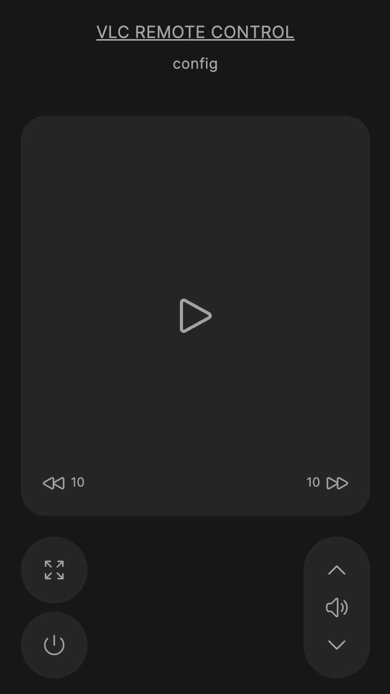

# VLC Remote Control

This Python program provides a web-based remote control interface for VLC media player. It allows users to control VLC playback from a different device using a web browser.

<p align="center">
  
</p>

## Use case

- 🎥 You are watching a movie on your computer or another screen
- 🛏️ You want to get comfortable and unwind while watching
- 📱 Use your phone to manage VLC playback!

## Features
- Play, pause, volume control, move forward and back, full-screen and quit functionalities.
- Customizable shortcuts for VLC commands.
- User-friendly web interface (heavily inspired by the [Apple TV Remote](https://support.apple.com/en-gb/HT201664#setup)).

## Prerequisites
- Python 3.x
- VLC media player installed on the system.

## Installation
1. Clone the repository:

```bash
git clone https://github.com/franciscobmacedo/vlc-remote-control.git
```

1. Create and activate a virtual environment:

**MacOS/Linux:**
```bash
python -m venv venv
source venv/bin/activate
```

**Windows (:warning: not tested):**
```bash
python -m venv venv
venv\Scripts\activate
```

2. Install the required dependencies:
```bash
pip install -r requirements.txt
```

## Usage

1. On the machine that is running VLC, start the server:

```bash
python run.py
```
take not of the url displayed in the terminal.

2. On the device that you want to use as a remote control (for example, your phone) open your web browser and navigate to the above mentioned url (something like http://192.168.1.92:8004). This device needs to be connected to the same wifi network.
3. Customize the commands in the config page to match your VLC shortcuts ([see here for help on how to set them up](https://www.vlchelp.com/vlc-media-player-shortcuts/)).
3. Use the buttons on the web interface to control the VLC media player.


## Configuration

In the [settings file](/src/settings.py), you can also edit the following variables:

- `OPEN_VLC_COMMAND`: Specifies the shortcut used to open the VLC player.
- `PORT`: Defines the port on which the server will run.
- `CONFIG_PATH`: Points to the location of the configuration file.
- `DEFAULT_SHORTCUTS`: Contains the default shortcuts that will be used when the user chooses to reset settings.

## Automation
You can also automate the process of starting the virtual environment, installing dependencies and running the server by running the `run.sh` script.


## Contributing
Contributions are welcome! Please fork the repository and create a pull request with your proposed changes.

## License
MIT License

## Support
If you encounter any problems or have questions, please open an issue on the GitHub repository.
